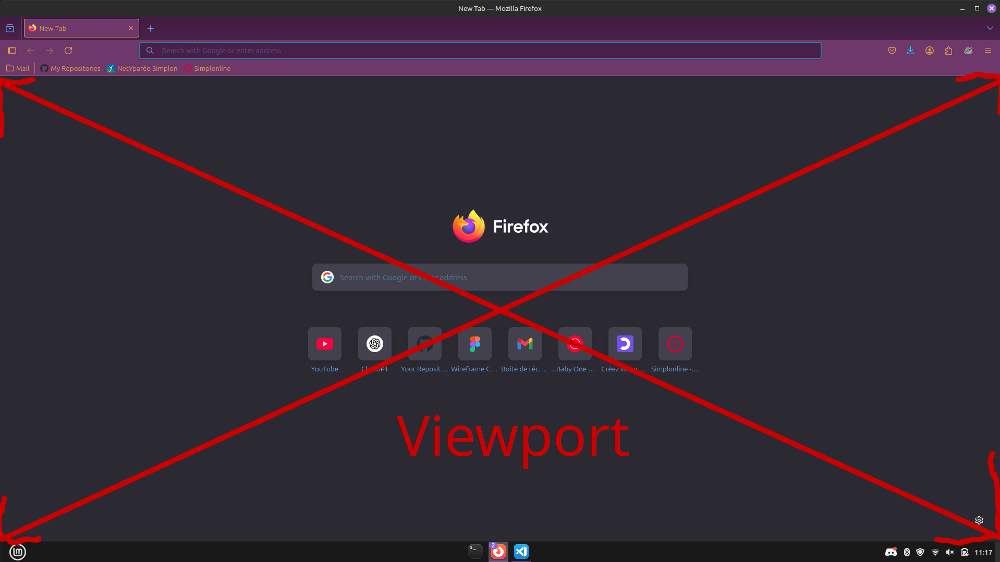

# Notes Jour-17

## Unités CSS

* 1px --> Fixed Unit
* 1vh --> Unit relative to the height of the viewport
* 1vw --> Unit relative to the width of the viewport
* 1em --> Unit relative to the parent's font size (by default: 16)
* 1rem --> Unit relative to the root element's font size (so the default `<html>` font size)
* 1% --> Unit relative to the value of the parent's attribute

## Viewport

The Viewport is the region of the screen used to display a portion of the total image to be shown.

It's pixel 0 is situated in the top left corner of the viewport.

## Positionning

* Static: default position in the normal flow
* Absolute: relative to pixel 0
* Relative: relative to the initial position of the element
* Fixed: fixed to the viewport
* Sticky: starts of as Static, and becomes Fixed once the element reaches the end of the viewport
